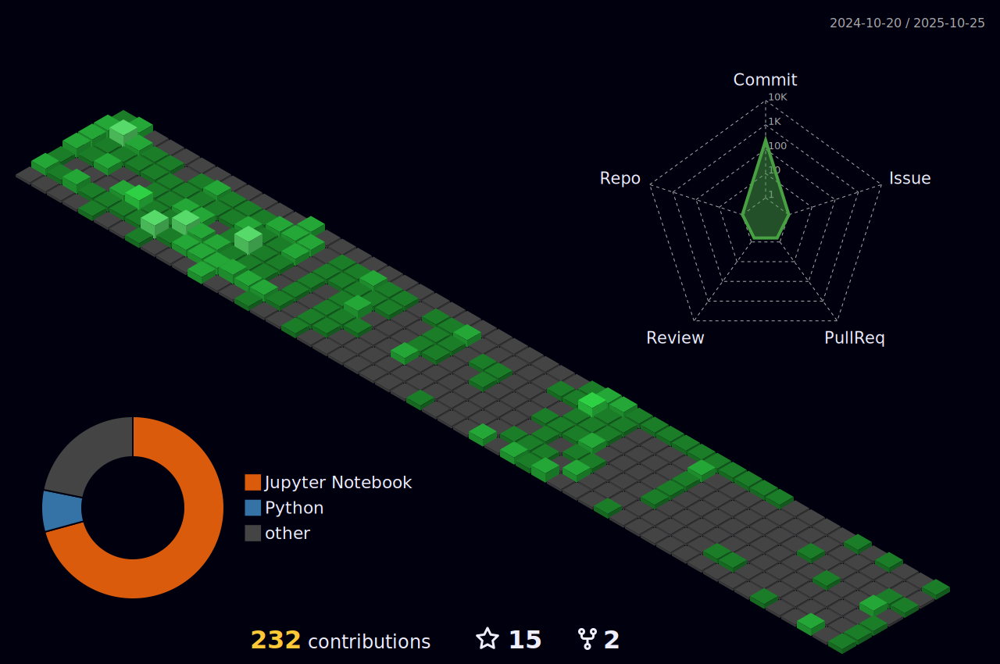

#  Hi, my name is David Kim. 

 

  
  
  
  
  
  
  
  
I will grow into a legendary Data Scientist.
  

 

`Tech Stack(Main)`
  

 

 

 

 

 

 

 

  

`Tech Stack(Sub)`
  

 

 

  

`contact`
  

  

 

 

